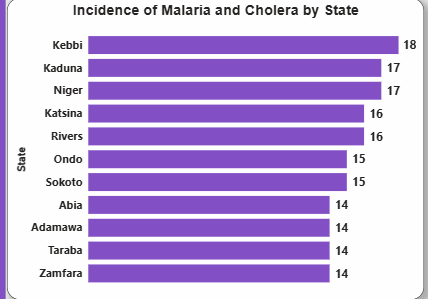
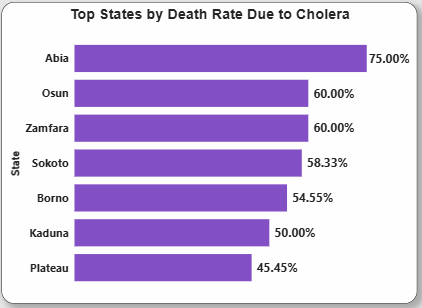
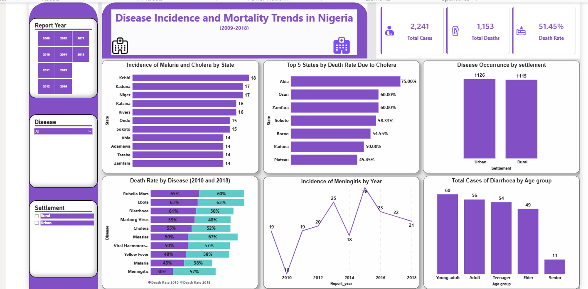

# Patient Disease Burden & Mortality Trends: A Hospital Data Analysis (2009–2018)

--- 
## Project Overview

This project analyzes disease incidence and mortality trends in a Nigerian hospital  between 2009 and 2018 using **Microsoft Power BI**.

The objective is to uncover key public health insights related to:

- Disease burden
- Mortality patterns
- Geographic disparities
- Demographic vulnerability
- Year-based trend shifts

The dashboard enables interactive exploration across states, diseases, settlement types, and age groups to support data-driven health decision-making.

---
##  Problem Statement

- Which states has the highest incidence of **Malaria and Cholera**?
- Which State has the highest death rate due to **Cholera**?
- Which group do we have the highest disease occurrence, **rural or urban**?
- Which diseases has the highest death rate in 2010 and 2018?
- Which year do we have highest incidence of Meningitis?
- Which Age group  are more perceptible to Diarrhoea?

---
##  Dataset Scope

- **Location:** Nigeria  
- **Period Covered:** 2009 – 2018  

### Key Fields Used

- Report Year  
- State  
- Disease  
- Settlement (Urban / Rural)  
- Age Group  
- Outcome (Deaths)  
- Total Cases

---
  ## Tools & Techniques

- Microsoft Power BI
- Power query(data cleaning) 
- DAX Measures (KPIs and filtered calculations)  
- Interactive slicers (Year, Disease, Settlement)  

--- 
## Key Performance Indicators (KPIs)

| Metric | Value |
|--------|-------|
| Total Cases | 2,241 |
| Total Deaths | 1,153 |
| Overall Death Rate | 51.45% |

---

## Key Questions Answered

### WHICH STATES HAVE THE HIGHEST INCIDENCE OF MALARIA AND CHOLERA?

- Kebbi recorded the highest number of reported cases (18 cases) of Cholera by state.

- Kaduna and Niger had the next highest cases of cholera reported (17 cases each).

  ### WHICH STATE HAS THE HIGHEST DEATH RATE DUE TO CHOLERA?

- Abia has the highest cholera mortality rate at 75%, indicating a severe fatality burden in that state.
  
- Osun and Zamfara share the second-highest mortality rate at 60%, meaning:
  6 out of every 10 cholera patients did not survive.
  
- This indicates that high cholera fatality is not isolated to one state, but appears across multiple regions.

---

## Key Insights & Findings

The overall death rate remains high at 51.45%.

Abia State has the highest cholera mortality rate (75%).

Urban areas report slightly more cases than rural areas.

Meningitis peaked in 2015.

Measles and Meningitis death rates increased significantly between 2010 and 2018.

Malaria death rate declined from 45% to 38%.

Young adults are the most affected age group for diarrhoea.

#  Recommendations

### - Strengthen Measles & Meningitis Control Programs  
Both diseases show significant mortality increases between 2010 and 2018.

### - Target High-Mortality States  
Abia requires urgent cholera intervention due to its 75% death rate.

### - Improve Urban Disease Surveillance  
Urban areas show slightly higher disease burden.

### - Focus Public Health Campaigns on Young Adults  
Young adults represent the most affected age group for diarrhoea.

### - Sustain Malaria Mortality Reduction Efforts  
Malaria death rate declined from 45% to 38% — continued efforts are needed.

---
#  Conclusion

This Power BI dashboard provides a structured analysis of disease incidence and mortality patterns in Nigeria between 2009 and 2018.

The findings highlight:

- High overall mortality burden  
- Disease-specific mortality shifts  
- Geographic disparities  
- Age-based vulnerability patterns  
- Urban-rural distribution differences  

The insights support data-driven public health strategies aimed at reducing mortality and strengthening disease response systems.

---

